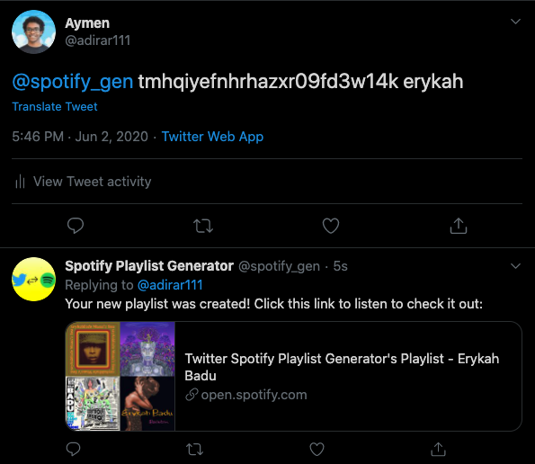
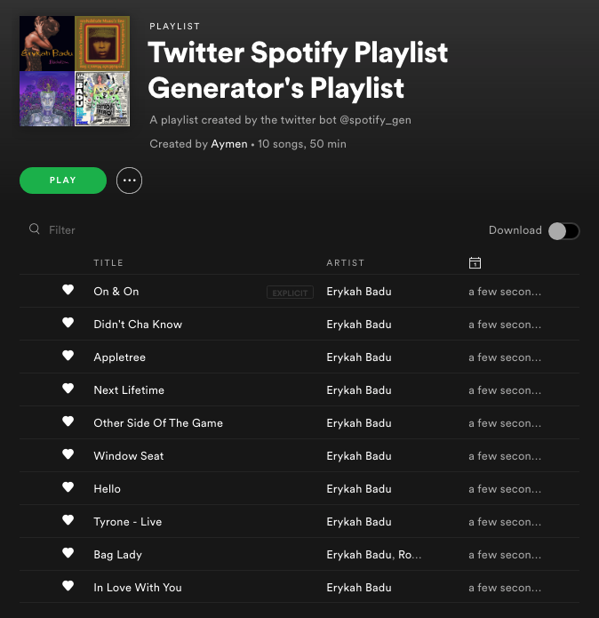

# Twitter Spotify Playlist Generator

This is a Twitter bot that, when tweeted at with a username and an artist name, will make a Spotify playlist of that artist's top tracks. The Twitter bot will then reply back to users with the link for their new playlist.  

## How to use:

To use the bot, run the script in twitter_bot.py

Ensure you create a secrets.py file in the folder with the appropriate api keys and variable names.

First, follow the bot on twitter in order for it to receive your tweets.

In order for it work properly the tweet should be formatted as the following:
> @spotify_gen [username] [search-string]

where the _username_ is your spotify username obtained by heading over to [accounts.spotify.com](https://accounts.spotify.com/), signing in, and looking at your "Account overview" tab. The _search-string_ should be a single word artist name. As of now, there is no support for multi-word artist names, but usually, picking the most significant word in a multi-word artist name tends to do the trick. Feel free to fork this repo and add that functionality if you'd like!

After tweeting, you should be redirected to a Spotify page asking for you to authorize the application access into your account. After clicking accept you'll be redirected to a Google search page (unfortunately, this is necessary when working with the spotipy library). Copy the link of the Google search page you were redirected to and paste it into your terminal next to the "Enter URL" prompt. That should get spotipy working. 

You should then get a tweet from the Twitter bot with your new playlist.

## Screenshots

### Twitter bot interaction:

### The created playlist:

